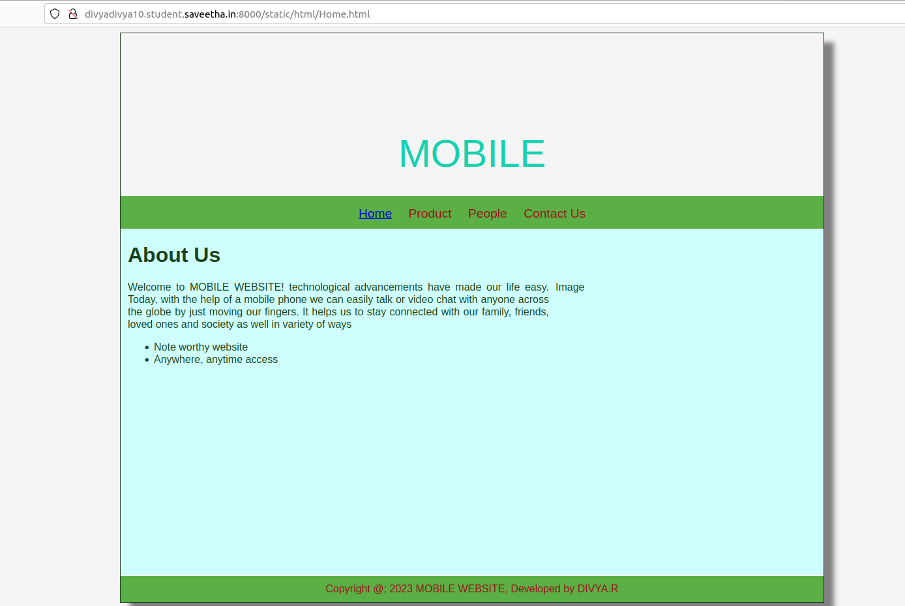
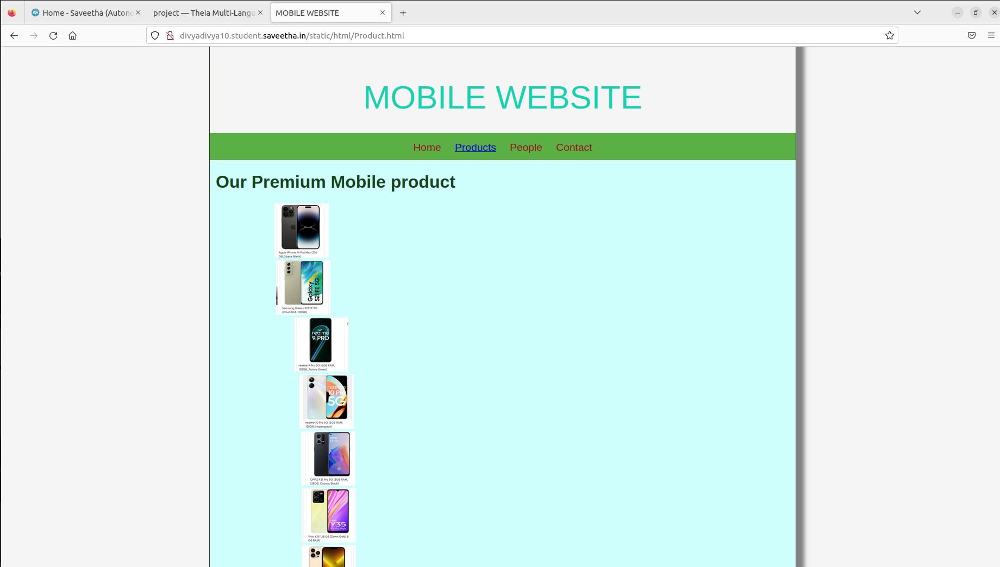
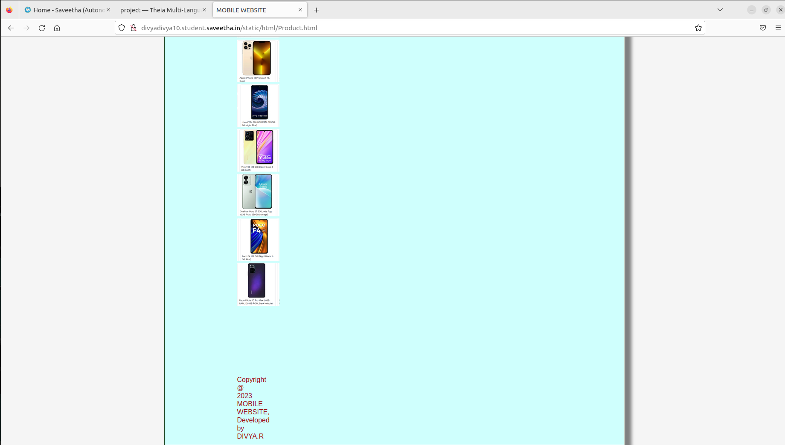
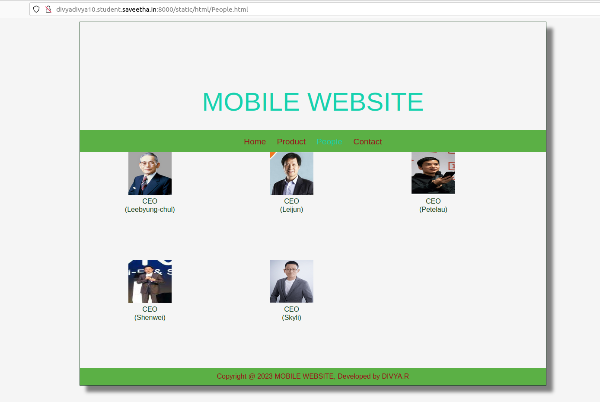
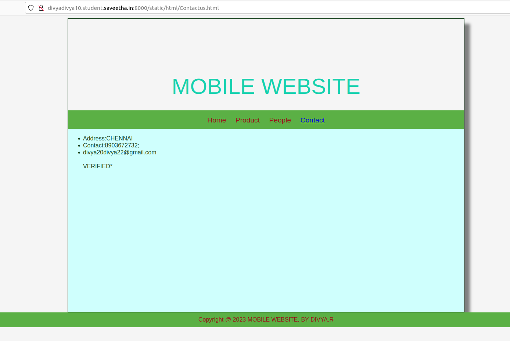

# Web Design for a Software Product Company

## AIM:

To design a static website for a software product company company.

## DESIGN STEPS:

### Step 1:

Requirement collection.

### Step 2:

Creating the layout using HTML and CSS.

### Step 3:

Updating the sample content.

### Step 4:

Choose the appropriate style and color scheme.

### Step 5:

Validate the layout in various browsers.

### Step 6:

Validate the HTML code.

### Step 6:

Publish the website in the given URL.

## PROGRAM :
HOME PAGE:
```
<!DOCTYPE html>
<html lang="en">
  <head>
    <title>MOBILE WEBSITE</title>
    <link rel="stylesheet" href="../css/layout.css" />
    <link rel="icon" href="./img/mobilelogo..png" type="image/x-icon" />
  </head>

  <body>
    <div class="container">
      <div class="banner">MOBILE</div>
      <div class="menu">
        <div class="menuitemselected"><a href="/static/Home.html">Home</a></div>
        <div class="menuitem"><a href="/static/Products.html">Product</a></div>
        <div class="menuitem"><a href="/static/People.html">People</a></div>
        <div class="menuitem"><a href="/static/Contactus.html">Contact Us</a></div>
      </div>
      <div class="content">
        <div class="homecontent">
          <h1>About Us</h1>
          
          <div class="contenttext">
            Welcome to MOBILE WEBSITE!
            technological advancements have made our life easy. 
            Today, with the help of a mobile phone we can easily talk or video chat with anyone across the globe by just moving our fingers.
           It helps us to stay connected with our family, friends, loved ones and society as well in variety of ways 

            <ul>
              <li>Note worthy website</li>
              <li>Anywhere, anytime access</li>
            </ul>
          </div>
        </div>
      </div>
      <div class="footer">
        Copyright @; 2023 MOBILE WEBSITE, Developed by DIVYA.R
      </div>
    </div>
  </body>
</html>
```
PRODUCT PAGE:
```
<!DOCTYPE html>
<html lang="en">
  <head>
    <title>MOBILE WEBSITE</title>
    <link rel="stylesheet" href="../css/layout.css" />
    <link rel="icon" href="./img/mobilelogo.png " type="image/x-icon" />
  </head>

  <body>
    <div class="container">
      <div class="banner">MOBILE WEBSITE</div>
      <div class="menu">
        <div class="menuitem"><a href="/static/Home.html">Home</a></div>
        <div class="menuitemselected"><a href="/static/Product.html">Products</a></div>  
        <div class="menuitem"><a href="/static/People.html">People</a></div>
        <div class="menuitem"><a href="/static/Contactus.html">Contact</a></div>
      </div>
      <div class="content">
        <div class="productcontent">    
          <h1>Our Premium Mobile product</h1>
          <div class="productitems">

              <div class="productitem"> 
                  <div class="itemimage">
                  
              </div>

              <div class="productitem"> 
                  <div class="itemimage">
                  
              </div>

              <div class="productitem"> 
                  <div class="itemimage">
                  
              </div>

              <div class="productitem"> 
                <div class="itemimage">
                
            </div>

            <div class="productitem"> 
              <div class="itemimage">
              
          </div>

          <div class="productitem"> 
            <div class="itemimage">
            
        </div>

        <div class="productitem"> 
          <div class="itemimage">
          
      </div>

      <div class="productitem"> 
        <div class="itemimage">
        
    </div>

    <div class="productitem"> 
      <div class="itemimage">
      
    </div>

    <div class="productitem"> 
       <div class="itemimage">
       
    </div>
    <div class="productitem"> 
      <div class="itemimage">
      
    </div>

    <div class="productitem"> 
      <div class="itemimage">
      
      </div>
    </div>
  </div>        
  </div>
    <div class="footer">
      Copyright @ 2023 MOBILE WEBSITE, Developed by DIVYA.R
    </div>
  </div>
 </body>
</html>
```
PEOPLE PAGE:
```
<!DOCTYPE html>
<html lang="en">
  <head>
    <title>MOBILE WEBSITE</title>
    <link rel="stylesheet" href="../css/layout.css"/>
    <link rel="icon" href="./img/mobilelogo.png" type="image/x-icon" />
  </head>

  <body>
    <div class="container">
      <div class="banner">MOBILE WEBSITE</div>
      <div class="menu">
        <div class="menuitem"><a href="/static/Home.html">Home</a></div>
        <div class="menuitem"><a href="/static/Products.html">Product</a></div>  
        <div class="menuitemselected"><a href ="/static/People.html"></a>People</a></div>
        <div class="menuitem"><a href="/static/Contactus.html">Contact</a></div>
      </div>
      <div class="productitem"> 
        <div class="itemimage">
        
      </div>
      <div class="itemname">CEO
           <br>
           (Leebyung-chul)
         </div>
    </div>
      <div class="productitem"> 
        <div class="itemimage">
        
      </div>
      <div class="itemname">CEO
           <br>
           (Leijun)
         </div>
      </div>
      <div class="productitem"> 
        <div class="itemimage">
        
      </div>
       <div class="itemname">CEO
           <br>
           (Petelau)
         </div>
      </div>
      <div class="productitem"> 
        <div class="itemimage">
        
      </div>
       <div class="itemname">CEO
           <br>
           (Shenwei)
         </div>
      </div>
      <div class="productitem"> 
        <div class="itemimage">
        
      </div>
       <div class="itemname">CEO
           <br>
           (Skyli)
         </div>
      </div>
      <div class="footer">
        Copyright @ 2023 MOBILE WEBSITE, Developed by DIVYA.R
      </div>
    </div>
  </body>
</html>
```
CONTACT PAGE:
```
<!DOCTYPE html>
<html lang="en">
  <head>
    <title>MOBILE WEBSITE</title>
    <link rel="stylesheet" href="../css/layout.css" />
    <link rel="icon" href="/static/img/mobilelogo.png" type="image/x-icon" />
  </head>

  <body>
    <div class="container">
      <div class="banner">MOBILE WEBSITE</div>
      <div class="menu">
        <div class="menuitem"><a href="/static/Home.html">Home</a></div>
        <div class="menuitem"><a href="/static/Product.html">Product</a></div>
        <div class="menuitem"><a href="/static/People.html">People</a></div>
        <div class="menuitemselected"><a href="/static/Contactus.html">Contact</a></div>
      </div>
      <div class="content">
          <ul>
              <li>Address:CHENNAI<br></li>
              <li>Contact:8903672732;<br></li>
              <li>divya20divya22@gmail.com<br></li>
              <br>VERIFIED*
          </ul>    
        </div>
    </div>
    </div>
    </div>
      <div class="footer">
        Copyright @ 2023 MOBILE WEBSITE, BY DIVYA.R
      </div>
    </div>
  </body>
</html> 
```
LAYOUT:
```
* {
  box-sizing: border-box;
  font-family:emoji;
}
body {
  background-color: #fefeff;
  color: #070707;
}
.container {
  width: 1080px;
  margin-left: auto;
  margin-right: auto;
  border-width: 1px 1px 1px 1px;
  border-style: solid;
  box-shadow: 15px 15px 8px #afbae0;
}

.banner {
  display: block;
  width: 100%;
  height: 500px;
  text-align: right;
  font-size: 65px;
  background-image: url("/static/img/mobilelogo.png");
  background-size: 100% 100%;
  margin: 0px 0px 0px 0px;
  padding-top: 230px;
  color: #0a090a;
}

.menu {
  display: block;
  width: 100%;
  height: 50px;
  font-size: larger;
  background-color: #afbae0;
  text-align: center;
  padding-top: 15px;
  margin: 0px 0px 0px 0px;
  border-width: 1px;
}

.menuitem {
  display: inline-block;
  margin-left: 10px;
  margin-right: 10px;
}
.menuitemselected {
  display: inline-block;
  margin-left: 10px;
  margin-right: 10px;
  color: #080808;
}

.menuitem a {
  text-decoration: none;
  color: #080808;
}

.content {
  display: block;
  width: 100%;
  background-color: #afbae0;
  min-height: 500px;
  margin: 0px 0px 0px 0px;
  border-width: 1px;
  border-color: #afbae0;
  border-style: solid;
}
.homecontent {
  min-height: 500px;
  margin: 10px 10px 10px 10px;
}
.homecontent h1 {
  text-align: left;
}
.homecontent img {
  float: right;
  width: 400px;
  height: 300px;
  margin-left: 10px;
}

.contenttext {
  text-align: justify;
}

.productcontent {
  min-height: 500px;
  margin: 10px 10px 10px 10px;
}

.productcontent h1 {
  text-align: left;
}

.productitems {
  display: block;
}

.productitem {
  display: inline-block;
  width: 30%;
  height: 250px;
  text-align: center;
}

.productitem img {
  width: 100px;
  height: 100px;
  display: block;
}
.productitem .itemimage {
  display: block;
  margin-left: auto;
  margin-right: auto;
  width: 100px;
  margin-bottom: 5px;
}

.productitem .itemname {
  display: block;
}
.productitem .itemprice {
  display: block;
}

.footer {
  display: block;
  width: 100%;
  height: 40px;
  background-color: #afbae0;
  text-align: center;
  padding-top: 10px;
  margin: 0px 0px 0px 0px;
  color: #000000;
}
```


## OUTPUT:

### Home Page:







## Result:

Thus a website is designed for the software product company and the HTML,CSS code are validated.
